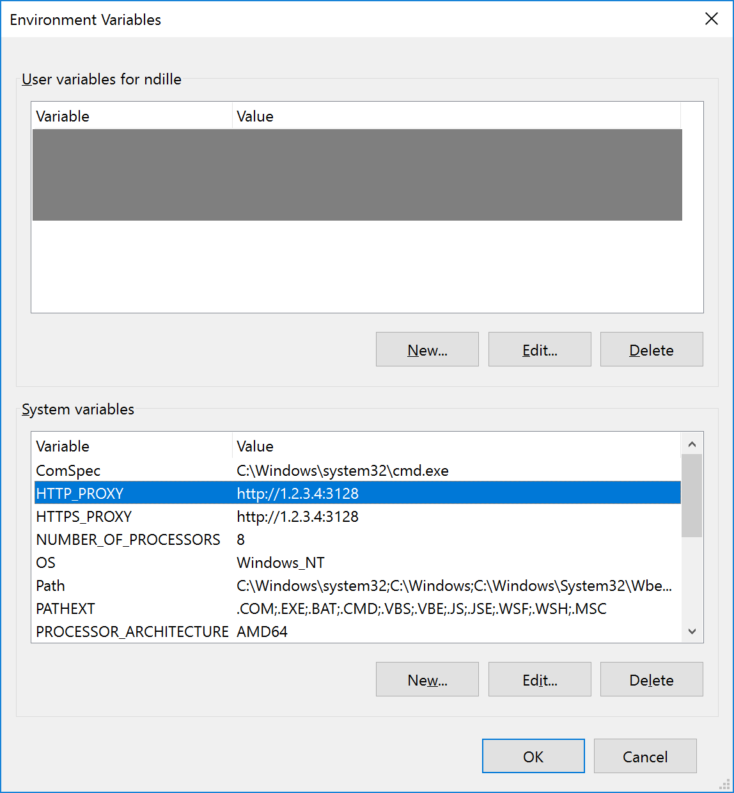

When using Windows containers on Windows 10, you sometimes end up behind a proxy server. Unfortunately, the Docker service does not use the proxy server configured for Windows itself. Instead, it uses the environment variables commonly used on Linux.<!--more-->

Many Linux based tools can be configured to use a proxy server by providing the following environment variables:

- `HTTP_PROXY` contains the proxy server for HTTP connections, e.g. `http://1.2.3.4:3128`

- `HTTPS_PROXY` contains the proxy server for HTTPS connections

- `NO_PROXY` defines IP ranges excluded from the proxy, e.g. `10.0.0.0/8 192.168.0.0/16 172.16.0.0/12`

Although you can create a start script for the Docker service, I recommend not to do this. Firstly, because it limits the proxy configuration to a single service. Secondly, it is harder to change the proxy configuration.

Instead, I recommend, you define the environment variables for the whole system. If using other tools relying on those environment variables, all are automatically configured to use the proxy server.

System variables can either be configured using the builtin dialog:

<div style="position: relative; overflow: hidden; width: 550px; height: 75px;"><a href="../../media/2017/02/Environment-Variables-Proxy.png" data-lightbox="WordPress2Jekyll" title="Dialog for system variables"></a></div>

If you are switching between proxy servers regularly, using the following code make this process a lot easier:

```powershell
[Environment]::SetEnvironmentVariable("HTTP_PROXY", "http://1.2.3.4:3128", [EnvironmentVariableTarget]::Machine)
[Environment]::SetEnvironmentVariable("HTTPS_PROXY", "http://1.2.3.4:3128", [EnvironmentVariableTarget]::Machine)
Restart-Service -Name docker
```